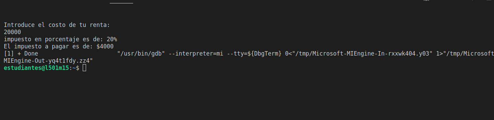
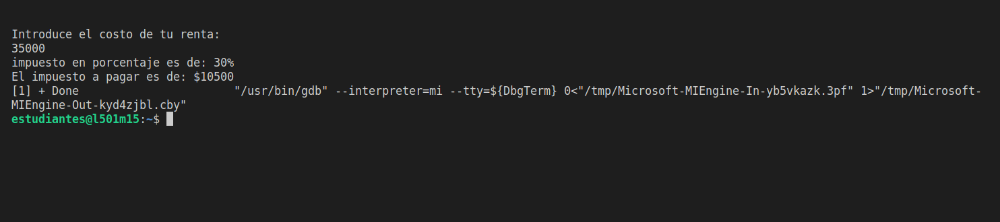
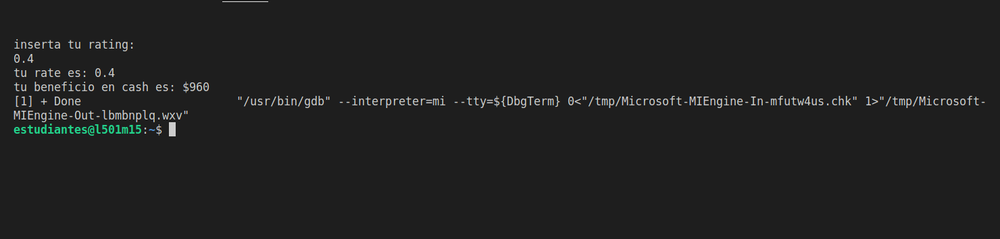
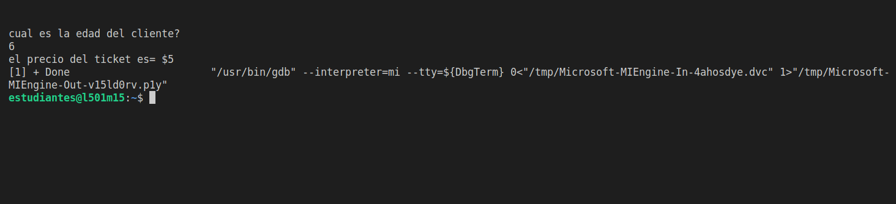
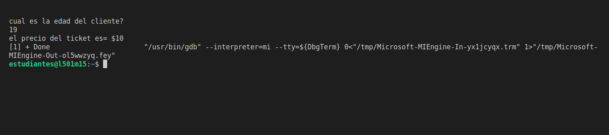
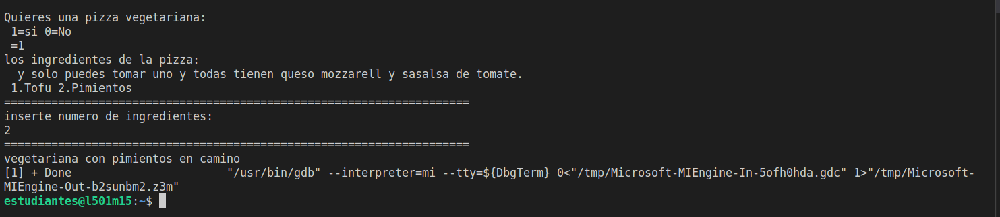
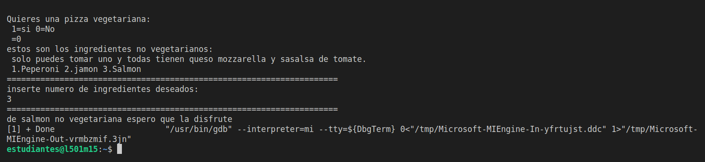
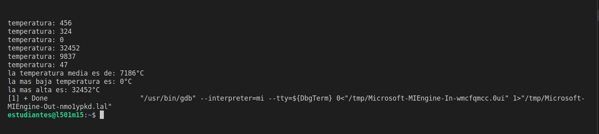
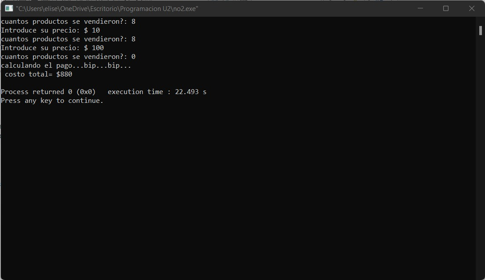
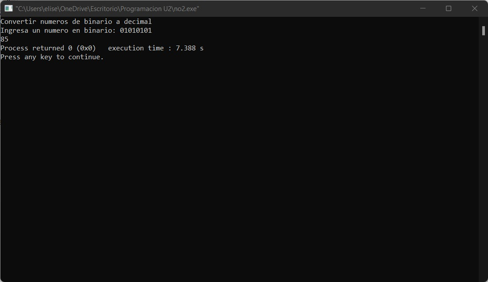

# Hola y bienvenido al repositorio 2
---
<center>hola

bienvenido


**Lista de trabajos**  
__en orden descendente__  

>lista
---
___
***

1. E01_tramos
````
#include <iostream>
using namespace std;
int main(){
int renta,impuesto;
cout<<"ingrese su renta";
cin>>renta;
if (renta < 10000)
{
    impuesto=renta*.05;
}
else if (renta < 20000)
{
    impuesto=renta*.15;
}
else if (renta < 35000)
{
    impuesto=renta*.2;
}
else if (renta < 60000)
{
    impuesto=renta*.3;
}
else
{
    impuesto=renta*.45;
}
cout<<"el impuesto es de ", impuesto;
}
````

2. E02_Abecedario

````
#include <iostream>
using namespace std;
int main(int argc, char const *argv[])
{
    char letra='A';
    char numero='1';
    for (int i = 0; i < 10; i++)
    {
        /* code */
        cout<<letra << "       ";
        letra= letra + 1;
    }
    letra='Z';
    for (int i = 0; i < 10; i++)
    {
        /* code */
        cout<<letra << "       ";
        letra= letra-1;
    }
    char numero='1';
    for (int i = 0; i < 10; i++)
    {
        /* code */
        cout<<letra << "       ";
        letra= letra + 1;
    }
    numero='10';
    for (int i = 0; i < 10; i++)
    {
        /* code */
        cout<<letra << "       ";
        letra= letra-1;
    }
        
    return 0;
}
````

3. E03_tablas
````
#include<iostream>
using namespace std;
int main(){
    int n=5;
    int i;
    cout<<"Tabla de multiplicar hecha con for \n";
    for (i = 1; i <= 10; i++)
    {
        cout<<n<<" * "<<i<<" = "<<n*i<<endl;
    }
    cout<<"\nTabla de multiplicar con for decreciente \n";
    for (i = 10; i > 0; i--)
    {
        cout<<n<<" * "<<i<<" = "<<n*i<<endl;
    }
    cout<<"\nTabla de multiplicar hecha con while \n";
    i=1;
    while(i<=10){
        cout<<n<<" * "<<i<<" = "<<n*i<<endl;
        i++;
    }
    cout<<"\nTabla de multiplicar con while de manera descendente\n";
    i=10;
    while(i>=1){
        cout<<n<<" * "<<i<<" = "<<n*i<<endl;
        i--;
    }
    cout<<"\nTabla de multiplicar con do while \n";
    i=1;
    do
    {
        cout<<n<<" * "<<i<<" = "<<n*i<<endl;
        i++;
    } while (i<=10);
    cout<<"\nTabla do while descendente \n";
    i=10;
    do
    {
        cout<<n<<" * "<<i<<" = "<<n*i<<endl;
        i--;
    } while (i>=1);
    return 0;
}
````

4. E04_Ciclowhile
````
//objetivo: while mientras true
#include <iostream>
using namespace std;
int main()
{
    int n, i;
    char opcion='s';
    
       while (opcion == 's')
       {
        printf("inserte numero: ");
    scanf("%d", &n);
    i=1;
    do
    {
        printf("%d x %d = %d \n", n, i,n*i);
        i++;
    } while (i<=10);
    
    
    printf("\nplanea hacer otro? <s/n> : ");
    scanf("%s", &opcion);
       }
       printf("...acabado");
       for ( i = 0; i < 100; i++)
       {
        for ( n = 0; n < 10; n++)
        {
            cout<<i<<"*"<<n<<"*"<<i*n<<endl;
        }
        cout<<endl;
       }
       
    return 0;
}
````
5. E05_Forfor
````
//objetivo for anidados
//  tablas del 1 al 10
#include <iostream>
using namespace std;
int main(int argc, char const *argv[])
{
    int n,i;
    i=1;
      for ( i = 0; i < 100; i++)
      {
        for ( n = 0; n < 10; n++)
        {
             cout<<i<<"*"<<n<<"*"<<i*n<<endl;
        }
        cout<<endl;
      }
      
    
    
    return 0;
}
````
6. BreakContinue
   ````
    #include<iostream>
    using namespace std;
    int main()
    {
    int n = 5;
    for (int i = 0; i < 10; i++)
    {
     if (i == 6)
     {
        break;
     } else{
         cout << i << endl;
       }
       cout << "numero" << i <<endl;
    }
    cout << ". . . hecho" << endl;
    return 0;
   }

   ````
7. Sumatoria
   ````
     /objetivo: sumatoria
     // debug
     #include<iostream>
     #include<stdio.h>
     using namespace std;
     int main (void){
     int numero, i, sumatoria = 0;

      printf("Ingresa un numero: ");
      scanf("%d", &numero);

     sumatoria = (numero * (numero + 1)) / 2;

      printf("La sumatoria de 1 a %d es %d", numero, sumatoria);

     return 0;
    }

   ````   
8. factorial
    ````
     #include <iostream>
     using namespace std;
     int main(){
     int e=5;
     int i=1;
     while (e>=0)
     {
        if(e==0){
            i=i*1;
        }else{
            i=i*e;
        }
        e--;
     }
     cout<<i;
     return 0;
     }     

    ````   
>tareas
---
<ol>
<li>01_impuestos.cpp</li>
````

     #include <iostream>
     using namespace std;
     int main()
     {
     int renta, porcentaje;
     float impuestoAPAgar;
    cout << "Introduce el costo de tu renta: " << endl;
    cin >> renta;
   
    if (renta < 10000)
    {
        porcentaje = 5;
    }
    if (renta >= 10000 && renta < 20000)
    {
        porcentaje = 15;
    }
    if (renta >= 20000 && renta < 35000)
    {
        porcentaje = 20;
    }
    if (renta >= 35000 && renta < 60000)
    {
        porcentaje = 30;
    }
    if (renta >= 60000)
    {
        porcentaje = 45;
    }
    impuestoAPAgar = renta * porcentaje / 100;
    cout << "impuesto en porcentaje es de: " << porcentaje << "%" << endl;
    cout << "El impuesto a pagar es de: $" << impuestoAPAgar << endl;
    return 0;
      }
    ````



 <li>02_dinero.cpp</li>

````
#include<iostream>
using namespace std;
int main(){
    float  ben;
    double cal;
    
    cout<<"inserta tu rating: "<<endl;
    cin>>cal;
    
    if (cal==0.0||cal==0.4||cal>=0.6&&cal<=1){
        ben= 2400*cal;
        cout<<"tu rate es: "<<cal<<endl;
        cout<<"tu beneficio en cash es: $"<<ben<<endl;
    }
    else {
        cout<<"Error: pon tu rating de forma correcta  "<<endl;
    }
    
        
    return 0;
}
````

<li>03_juegos.cpp</li>

````
#include <iostream>
using namespace std;
int main(){
    int coE, edad; 
    cout<<"cual es la edad del cliente? "<<endl;
    cin>>edad;
    if (edad<0){
        cout<<"mire la data insertada porfavor"<<endl;
    }
    else{
        if (edad<4){
            coE=0;
        }
        if (edad>=4 && edad<=18){
            coE=5;
        }
        if (edad>18){
            coE=10;
        }
    cout<<"el precio del ticket es= $"<<coE<<endl;
    }
    return 0;
}
````


<li>04_pizza.cpp</li>

````
#include <iostream>
using namespace std;
int main()
{
    int tp, iv, inv;
    cout << "Quieres una pizza vegetariana: \n 1=si 0=No  \n =";
    cin >> tp;
    if (tp == 1)
    {
        cout << "los ingredientes de la pizza: \n  y solo puedes tomar uno y todas tienen queso mozzarell y sasalsa de tomate. \n 1.Tofu 2.Pimientos " << endl;
        cout << "=====================================================================" << endl;
        cout << "inserte numero de ingredientes: " << endl;
        cin >> iv;
        cout << "=====================================================================" << endl;
        if (iv == 1)
        {
            cout << "tu pizza sera vegetariana con tofu" << endl;
        }
        else if (iv == 2)
        {
            cout << "vegetariana con pimientos en camino " << endl;
        }
        else
        {
            cout << "inserte datos correctos porfavor.";
        }
    }
    else if (tp == 0)
    {
        cout << "estos son los ingredientes no vegetarianos: \n solo puedes tomar uno y todas tienen queso mozzarella y sasalsa de tomate.  \n 1.Peperoni 2.jamon 3.Salmon " << endl;
        cout << "=====================================================================" << endl;
        cout << "inserte numero de ingredientes deseados: " << endl;
        cin >> inv;
        cout << "=====================================================================" << endl;
        if (inv == 1)
        {
            cout << "tu pizza es una de peperoni sin vegetal " << endl;
        }
        else if (inv == 2)
        {
            cout << "una de jamon no vegetariana en camino " << endl;
        }
        else if (inv == 3)
        {
            cout << "de salmon no vegetariana espero que la disfrute " << endl;
        }
        else
        {
            cout << "inserte data correcta.";
        }
    }
    else
    {
        cout << "=====================================================================" << endl;
        cout << "inserte datos correctos client@.";
    }
    return 0;
}
````



<li>05_temperatura.cpp</li>

````
#include <iostream>
using namespace std;
int main()
{
    int contador = 0;
    float teAc = 0, temperatura, tempM = -273, tempme = 100000;
    do
    {
        cout << "temperatura: ";
        cin >> temperatura;
        teAc += temperatura;
        contador++;
        if (temperatura >= tempM)
        {
                tempM = temperatura;
        }
        if (temperatura <= tempme)
        {
       
                  tempme = temperatura;
        }
    } while (contador < 6);
    cout << "la temperatura media es de: " << teAc / 6 << "°C" << endl;
    cout << "la mas baja temperatura es: " << tempme << "°C" << endl;
    cout << "la mas alta es: " << tempM << "°C" << endl;
    return 0;
}
````

<li>06_fact.cpp</li>

````
#include <iostream>
using namespace std;
int main()
{
    int cdp;
    float pdp, tf=0;
    do
    {
        cout << "cuantos productos se vendieron?: ";
        cin >> cdp;
        if (cdp != 0)
        {
            cout << "Introduce su precio: $";
            cin >> pdp;
    
        }
        tf += (cdp*pdp);
    } while (cdp > 0);
    cout << "calculando el pago...bip...bip...\n costo total= $" << tf << endl;
    return 0;
}
````

<li>07_inte-bina.cpp</li>

````
#include <iostream>
#include <string.h>
#include <math.h>
using namespace std;
int main(){
    char binario[30]="";
    int decimal=0;
    int numero=0;
    int contador, i;
    cout<<"Convertir numeros de binario a decimal \n";
    cout<<"Ingresa un numero en binario: ";
    cin>>binario;
    contador=strlen(binario);
    for (int i = 1; i <= contador; i++)
    {
        if (binario[i-1]=='1')
        {
            decimal=pow(2,contador-i);
            numero=numero +decimal;
        }
        
    }
    cout<<numero;
    return 0; 
}
````

</ol>