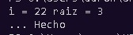
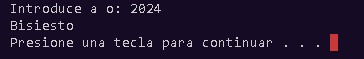
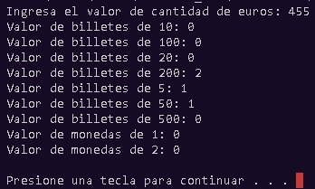
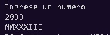
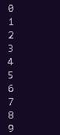

# Hola y bienvenido al repositorio 2
---
<center>good day

welcome again


**homeworks**  
__unit 3__  

>list
---
___
***

1. 01_Biseccion
````
 #include <iostream>
 #include <cmath>

 using namespace std;

 double fnEcuacion1(double x) // x^2 - 8x + 15
 {
    return pow(x,2) - 8*x + 15;
 }

 int main()
 
 {
    double x1= -10 , x2 = 4.5 , x = 0;

    double Ea = .001;            // Limita el margen del punto decimal  (Error estandar)

    double Er = abs(x2 - x1) ;  // Error relativo  abs = valor absoluto 

    int i = 1;

    while ( Er > Ea )
    {
        x = (x1 + x2) / 2;
         printf ("%3d | %10.4f | %10.4f | %10.4f | %10.4f | %10.4f | %10.4f | \n",  i , x1, x2 , Er, x, fnEcuacion1(x1), fnEcuacion1(x2));


        if (fnEcuacion1 (x1) * fnEcuacion1(x) < 0 )
        {
            x2 = x;
        }
        else 
        {
            x1 = x;
        }

        Er = abs(x2 - x1);

        i = i + 1 ;
    }
    
    cout << "i = "  <<  i  <<   "Raiz = " <<  x <<  endl;

    return 0;
 }
````



2. 02_grado a radian

````
#include <stdio.h>
#define PI 3.14159265358979323846

double gradosARadianes(double grados)
{
    return grados * PI / 180;
}

double radianesAGrados(double radianes)
{
    return radianes * 180 / PI;
}

int main()
{
    // Probar. 1 radián equivale a 57.2958 grados
    double radianes = 1;
    double convertidosAGrados = radianesAGrados(radianes);
 printf("%.4f radianes equivalen a %.4f grados\n", radianes, convertidosAGrados);
    // Y lo inverso
    double grados = 57.2958;
    double convertidoARadianes = gradosARadianes(grados);
    printf("%.4f grados equivalen a %.4f radianes\n", grados, convertidoARadianes);
    return 0;
}
````


3. 03_anio bisiesto
````
 #include <iostream>
using namespace std;

bool Bisiesto(int ano){
    bool r;
    r = ano%400==0 || ano%4==0 && ano%100!=0;
    return r;
}

int main(){
int ano;
cout<<"Ingresa un anio: ";
cin>>ano;
if(Bisiesto(ano)){
    cout<<ano<<" es bisiesto";
} else{
    cout<<ano<<" no es bisiesto";
}
return 0;
}

````



4. 04_Coseno
````
 #include <iostream>
 #include <math.h>
 using namespace std;

 double G2R(double g){
    double r;
    r=g*M_PI/180;
    return r;
 }

 long int factorial(int x){
    int factorial=1;
    while (x>0)
    {
        factorial=factorial*x;
        x--;
    }
    return factorial;
 }

 double coseno(double g, int i){
    double c;
    c=pow(-1,i)*pow(G2R(g),2*i)/(factorial(2*i));
    return c;
 }

 int main(){
    int g=45;
    double x1=10;
    double Es=0.00001;
    double c=0;

    double Er=x1-c;
    int i=0;

    while(Er>Es){
        x1=c;
        c=c+coseno(g,i);
         Er=abs(x1-c);
        i++;
    }
    cout<<"El coseno de "<<g<<" grados es: "<<c;
    return 0;
 }
````


5. 05_Desgloce
````
#include <iostream.h>
    #include <stdlib.h>
#else
    #include <iostream>
    #include <cstdlib>
    using namespace std;
#endif

int main (void)
{
int billetes_de_10, billetes_de_100, billetes_de_20, billetes_de_200, billetes_de_5;
    int billetes_de_50, billetes_de_500, cantidad_de_euros, monedas_de_1, monedas_de_2;
    cout << "Ingresa el valor de cantidad de euros: ";
    cin >> cantidad_de_euros;
    cin.get();
    monedas_de_1=cantidad_de_euros;
    billetes_de_500=(monedas_de_1-monedas_de_1%500)/500;
    monedas_de_1=monedas_de_1%500;
    billetes_de_200=(monedas_de_1-monedas_de_1%200)/200;
    monedas_de_1=monedas_de_1%200;
    billetes_de_100=(monedas_de_1-monedas_de_1%100)/100;
    monedas_de_1=monedas_de_1%100;
    billetes_de_50=(monedas_de_1-monedas_de_1%50)/50;
    monedas_de_1=monedas_de_1%50;
    billetes_de_20=(monedas_de_1-monedas_de_1%20)/20;
    monedas_de_1=monedas_de_1%20;
    billetes_de_10=(monedas_de_1-monedas_de_1%10)/10;
    monedas_de_1=monedas_de_1%10;
    billetes_de_5=(monedas_de_1-monedas_de_1%5)/5;
monedas_de_1=monedas_de_1%5;
    monedas_de_2=(monedas_de_1-monedas_de_1%2)/2;
    monedas_de_1=monedas_de_1%2;
    cout << "Valor de billetes de 10: " << billetes_de_10 << endl;
    cout << "Valor de billetes de 100: " << billetes_de_100 << endl;
    cout << "Valor de billetes de 20: " << billetes_de_20 << endl;
    cout << "Valor de billetes de 200: " << billetes_de_200 << endl;
    cout << "Valor de billetes de 5: " << billetes_de_5 << endl;
    cout << "Valor de billetes de 50: " << billetes_de_50 << endl;
    cout << "Valor de billetes de 500: " << billetes_de_500 << endl;
    cout << "Valor de monedas de 1: " << monedas_de_1 << endl;
    cout << "Valor de monedas de 2: " << monedas_de_2 << endl;
    cout << endl;
    system ("pause");
    return EXIT_SUCCESS;
}

````



6. 06_Desviacion
````
  import statistics
#include <iostream>
#include <math.h>
using namespace std;
 
 double media(double x[],int n){
    double media=0;
    for (int i = 0; i < n; i++)
    {
        media=media+x[i];
    }
    media=media/n;
    return media;
 }

 double desviacion(double x[], int n){
   double me= media(x,n);
   double des=0;
   for (int i = 0; i < n; i++)
   {
      des=des+pow(x[i]-me,2);
   }
   des=sqrt(des/n);
   return des;
 }

 int main(){
    double numeros[]={600,470,170,430,300};
    int n;
    n=sizeof(numeros)/8;
    cout<<"Media: "<<media(numeros,n)<<endl;
    cout<<"Desviacion estandar: "<<desviacion(numeros,n);
    return 0;
 }

   ````
  


7. 07_Numeros Romanos
   ````
    #include <iostream> //  necesarios para el cin y cout 
    using namespace std; 

    int main () 
    {
    int numero, unidades, decenas, centenas, millares;
 
    cout<< "Ingrese un numero"<<endl;
    cin>> numero;

    //Esto se hace para separar el numero,
     tomen como ejemplo el numero 2103, a ese numero
     lo debemos transformar de la manera siguiente: 
    2 - 1 - 0 - 3 donde 3 va a ocupar la unidades, 
     0 las decenas, 1 las centenas y 2 los millares//

     unidades = numero % 10; numero /= 10;
     decenas = numero % 10; numero /= 10;
     centenas = numero % 10; numero /= 10;
     millares = numero % 10; numero /= 10;

     switch (millares)
     {
     case 1: cout<<"M"; break;
     case 2: cout<<"MM"; break;
      case 3: cout<<"MMM"; break;
     }
 
     switch (centenas)
     {
    case 1: cout<<"C"; break;
     case 2: cout<<"CC"; break;
    case 3: cout<<"CCC"; break;
    case 4: cout<<"CD"; break;
    case 5: cout<<"D"; break;
    case 6: cout<<"DC"; break;
    case 7: cout<<"DCC"; break;
    case 8: cout<<"DCCC"; break;
    case 9: cout<<"CM"; break; 
    }
   switch (decenas)
   {
    case 1: cout<<"X"; break;
    case 2: cout<<"XX"; break;
    case 3: cout<<"XXX"; break;
    case 4: cout<<"XL"; break;
    case 5: cout<<"L"; break;
    case 6: cout<<"LX"; break;
    case 7: cout<<"LXX"; break;
    case 8: cout<<"LXXX"; break;
    case 9: cout<<"XC"; break; 
   }
 
   switch (unidades)
   {
    case 1: cout<<"I"; break;
    case 2: cout<<"II"; break;
    case 3: cout<<"III"; break;
    case 4: cout<<"IV"; break;
    case 5: cout<<"V"; break;
    case 6: cout<<"VI"; break;
    case 7: cout<<"VII"; break;
    case 8: cout<<"VIII"; break;
    case 9: cout<<"IX"; break;
     }

   return 0;
    }

  ````   
  

8. 08_vector
  **Consecutive values ​​are taken and their exchanges, only stopping when all the numbers have been used** 

    ````
    #include <iostream>
using namespace std;

void Ordenar(int x[],int v){
    int m,s,c;
    do{
        c=0;
        for (int i = 0; i < v; i++)
        {
            s=i+1;
            if (x[i]>x[s])
            {
                m=x[s]; x[s]=x[i]; x[i]=m;
                c++;
            }   
        }
        
    } while(c>0);
  }

  int main(){
    int c[]={9,8,7,6,5,4,3,2,1,0};
    int n=sizeof(c)/4;
    Ordenar(c,n);
    for (int i = 0; i < n; i++)
    {
        cout<<c[i]<<endl;
    }
    return 0;
 }
   }    

 ````
 
 

9. 09_recursividad
  ````
   #include<iostream>
 #include<cstdlib>
 using namespace std;
 int binario(int n){
 if(n>1)      binario(n/2);
 cout<<n%2;
 }
 int main( void ){
 system(“color 0a”);
 int nro;
 cout<<“\n\t\t[     RECURSIVIDAD     ]\n“;
 cout<<“\t\t————————\n\n“;
 cout<<”Convertir a binario un numero decimal “<<endl<<endl;
 do{
 cout<<” INGRESE NUMERO: “;
 cin>>nro;
 if(nro<0) cout<<“\nINGRESE UN NUMERO ENTERO Y POSITIVO… \n“;
 }while(nro<0);
 cout<<endl;
 cout<<“\n Numero:”<<nro<<endl;
 cout<<“\n Binario:”;
    binario(nro);
 return 0;
 }

   ````

 10. 10_rfc
  ````
 #include <iostream>
#include <cstring>
using namespace std;

int main(){
    string nombre="Carlos";
    string AP="Esparza";
    string AM="Lopez";
    string fe="17/11/2022";
    string rfc="";
    int v=nombre.length(); 
    int p=0;
    AP[0]=tolower(AP[0]);
    
  for (int i = 0; i < v && p<2; i++)
    {
        if (AP[i]=='a' || AP[i]=='e' || AP[i]=='i' || AP[i]=='o' || AP[i]=='u' )
        {
            rfc=rfc+AP[i];
            p++;
        }  
    }
    AP[0]=toupper(AP[0]);

  int d1=fe.find_last_of("/");
    int d2=fe.find("/");
    rfc=rfc+AM[0]+nombre[0]+fe.substr(d1+1,4)+fe.substr(d2+1,2)+fe.substr(0,2);
    
  v=rfc.length();
    for (int i = 0; i < v; i++)
     {
        rfc[i]=toupper(rfc[i]);
     }
  cout<<nombre<<" RFC: "<<rfc;
  return 0;
     }

 ````

  
<ol>